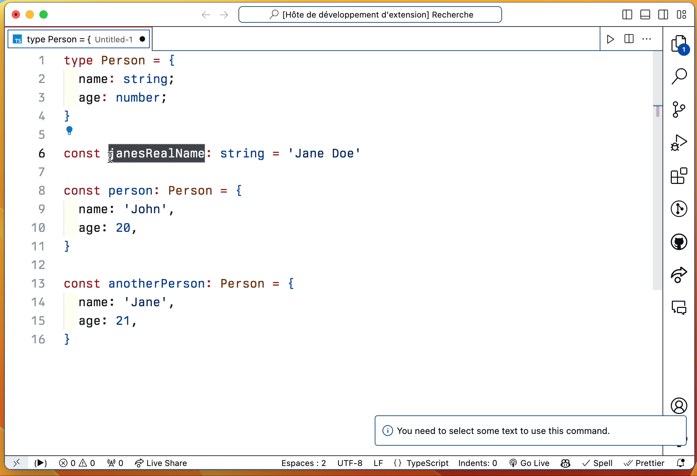

## VS CODE SWAP 🔁

<b>Swap 🔁</b> is a VS Code extension that makes swapping texts easy 😎

### Swap

### Replace Text at Line

Replace Text at Line format: __line-number:colStart-colEnd__. 

- If only colStart is provided, it replaces at colStart to the end of the line.
- If both colStart and colEnd are provided, it replaces the text in that range.
- If neither columnStart nor columnEnd are provided, it defaults to replacing the entire line.

### Instructions

#### Swapping 
* Select two or more texts
* Open `command palette` and type `Swap`
* Press enter and voilà ✅

#### Replacing 
* Select two or more texts
* Open `command palette` and type `Replace text at line`
* You will be asked the line number you want to replace selected text with.
* Press enter and voilà ✅

## Keyboard shortcuts

- Swapping: 
    * Windows: `CTRL+ALT+8`
    * Mac: `CMD+OPTION+8`
- Replacing: 
    * Windows: `CTRL+ALT+9`
    * Mac: `CMD+OPTION+9`

### Changelog

Current version: `v0.1.0`
