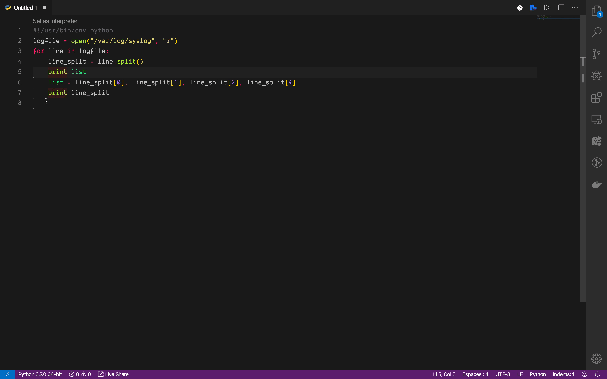

## VS CODE SWAP 🔁

<b>Swap 🔁</b> is a VS Code extension that makes swapping texts easy 😎

### Instructions

* Select two or more texts
* Open `command palette` and type `Swap`
* Press enter and voilà ✅

## Keyboard shortcuts

* Windows: `CTRL+ALT+8`
* Mac: `CMD+OPTION+8`

### Changelog

Current version: `v0.0.5`
