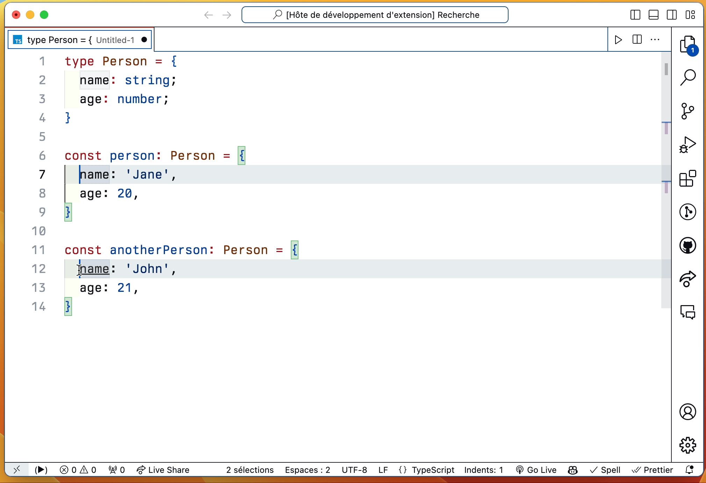

## VS CODE SWAP 🔁

<b>Swap 🔁</b> is a VS Code extension that makes swapping texts easy 😎

### Instructions

* Select two texts
* Open `command palette` and type `Swap`
* Press enter and voilà ✅

### Changelog

Current version: `v0.0.2`